# KASTERWEB Products Flag for Magento 1
Module developed to add images as product flags.
This module does not contemplate customizing the front end.

## Configure Module By Modman

To install Modman, you can either install the library in your user's root folder, or you can install Modman globally.
Regardless of which option you choose, first run one of these two scripts to download the Modman repo.
```
bash < <(wget -q --no-check-certificate -O - https://raw.github.com/colinmollenhour/modman/master/modman-installer)

or

bash < <(curl -s -L https://raw.github.com/colinmollenhour/modman/master/modman-installer)
```

Init Modman
 ```
modman init
 ```
 
Clone project using modman.
 ```
modman clone https://github.com/luanalves/Magento_FlagProducts.git
 ```
Install by modman
 ```
modman run deploy-all
 ```
 Run Setup Magento.


## Configure Flags
After running the module setup. The Kasterweb -> Manage Flags menu will appear.
This menu will be responsible for registering the images of the flags.

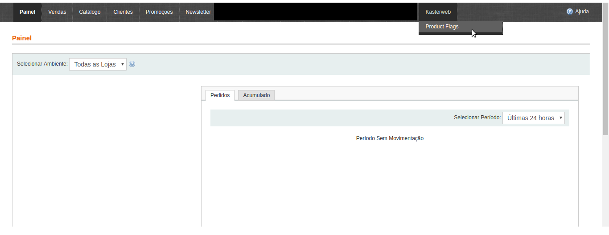
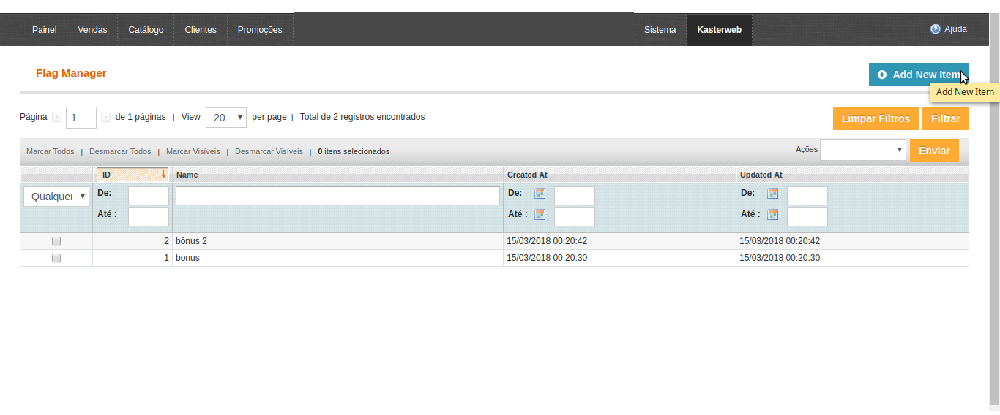
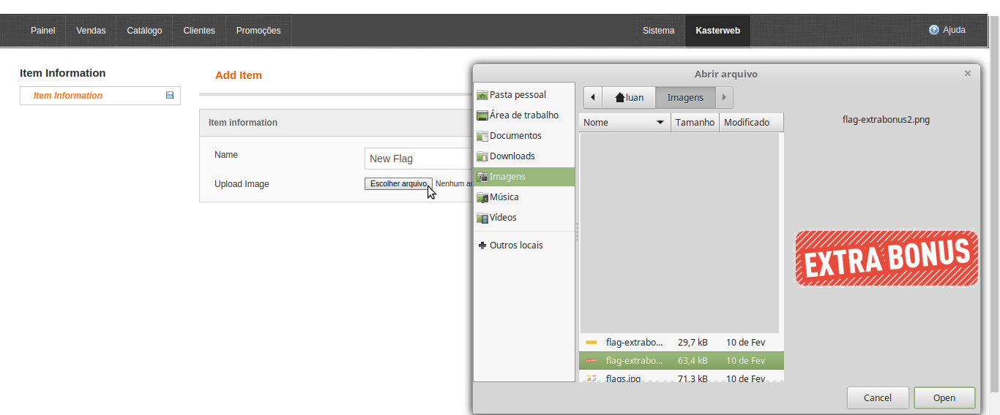
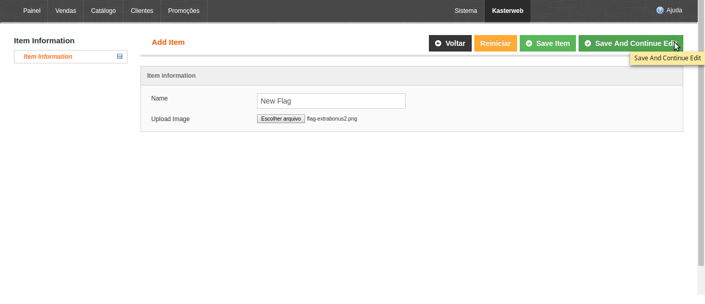


After registering the flags, simply access the desired product and enter the desired flag.

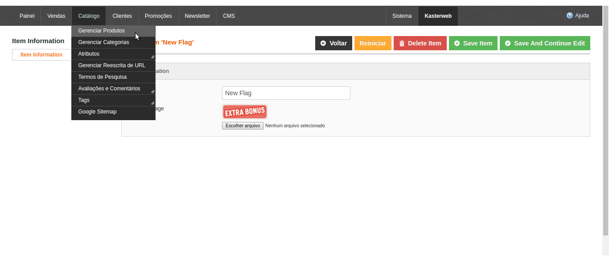
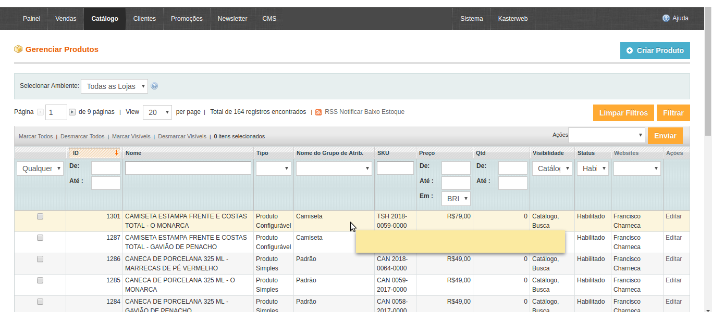
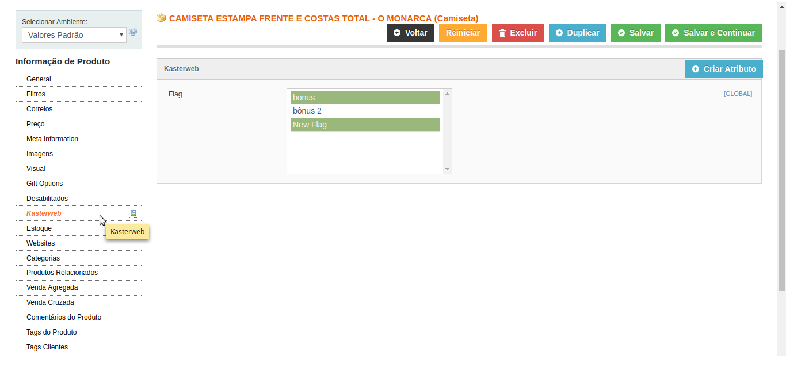


## Example of use
Add Code in Front End Page
```sh
<?php
$url = '';
if ($_product->getKasterwebFlag()) {
    if ($data = Mage::helper('kasterweb_flagproducts')->getPathFlagById($_product->getKasterwebFlag())) {
        if ($data) {
            if (is_array($data)) {
                foreach ($data as $key=>$item) {
                    echo  Mage::helper('kasterweb_flagproducts')->loadImageFlag($item,$_product,($key*10));
                }
            } else {
                echo  Mage::helper('kasterweb_flagproducts')->loadImageFlag($data,$_product);
            }
        }

    }
}
?>
```

CATEGORY LIST
<hr />

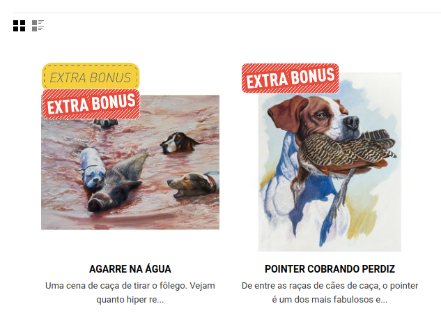
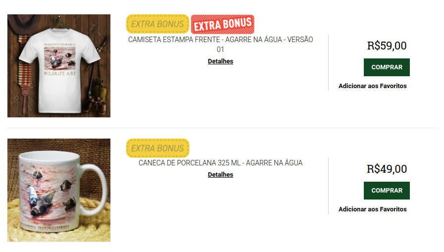


PRODUCT VIEW
<hr />


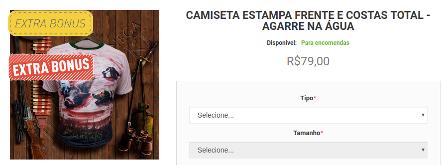
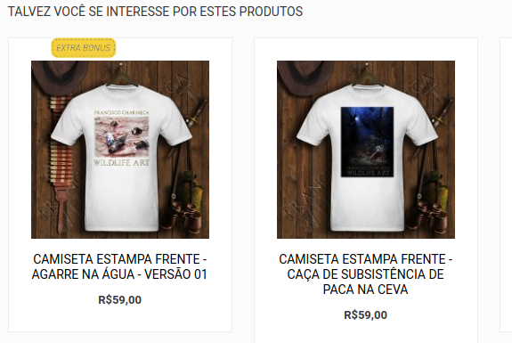
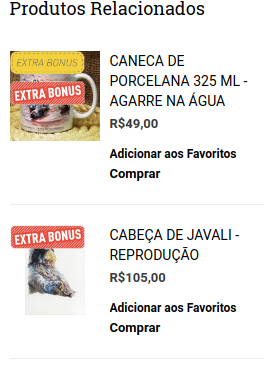
